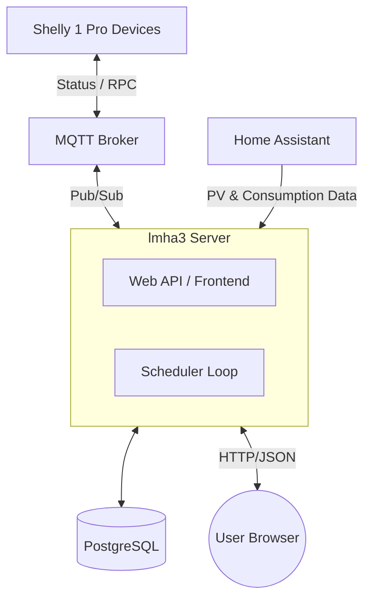

# lmha3: Lasten Management Hagenholz

Load management for multi-tenant houses sharing a photovoltaics installation. Matches physical tenant loads (Shelly 1 Pro) with solar production. 

Early work, use at your own risk.

## Architecture


### Components
- **Server**: 
    - **Web API**: Serves the vanilla JS Single-Page App and provides JSON endpoints for authentication and control. Both for administrators and tenants
    - **Scheduler Loop**: Background thread that matches solar production (obtained from Home Assistant) with tenant loads.
- **lmha-admin**: CLI tool for initial user creation and system management.
- **PostgreSQL**: Stores persistent state, historical telemetry, and user sessions.
- **MQTT Broker**: Handles bidirectional communication with physical Shelly hardware.
- **Home Assistant**: Source for real-time solar production and total house consumption.


## Configuration

The application is configured via environment variables.

| Variable | Description | Default |
|----------|-------------|---------|
| `LMHA_DATABASE_URL` | PostgreSQL connection string (e.g., `postgresql://...`) | (Required) |
| `LMHA_MQTT_HOST` | Hostname of the MQTT broker | `localhost` |
| `LMHA_MQTT_PORT` | Port of the MQTT broker | `1883` |
| `LMHA_MQTT_USER` | Username for MQTT authentication | (Optional) |
| `LMHA_MQTT_PASSWORD`| Password for MQTT authentication | (Optional) |
| `LMHA_INSTANCE_ID` | Unique identifier for this instance | `lmha3-<random>` |
| `LMHA_INSTANCE_PRIORITY`| Instance priority (higher number = higher priority) | `10` |

Remaining configuration (devices/PV URLs and API tokens) can be done via web interface and is stored in the database.

## Deployment

1. Install NixOS.
2. Drop the snippet below in your NixOs configuration and run `nixos-rebuild switch`.
3. On first start, the server will initialize the database and create a user `admin` with password `admin`. You should then immediately change the password in the webinterface.
4. Create the rest of the configuration in the Web UI with the admin user.

```nix
{ config, pkgs, ... }:
let
    lmha3-src = builtins.fetchGit {
        url = "https://github.com/example/lmha3.git";
        ref = "refs/tags/v0.0.20";
    };
in
{
  imports = [
    (import "${lmha3-src}/nix/module.nix")
  ];

  services.lmha3 = {
    enable = true;
    databaseUrl = "postgresql:///lmha3?host=/run/postgresql";
    mqtt = {
      host = "localhost";
      port = 1883;
    };
  };

  # Dependency: PostgreSQL
  services.postgresql = {
    enable = true;
    ensureDatabases = [ "lmha3" ];
    ensureUsers = [
      {
        name = "lmha3";
        ensureDBOwnership = true;
      }
    ];
  };

  # Dependency: Mosquitto (MQTT Broker)
  services.mosquitto = {
    enable = true;
    listeners = [
      {
        acl = [ "pattern readwrite #" ];
        address = "localhost";
        port = 1883;
        settings.allow_anonymous = true;
      }
    ];
  };
}
```

## Development

`nix develop` followed by `cargo test` or `cargo build` or ``cargo run -p server`

There is a convenience script `./dev.sh`

## Scheduler Data Model

The scheduler manages devices using four distinct modes: **Manual**, **Force ON**, **Force OFF**, and **Boiler**. In **Manual** mode, the scheduler ignores the device, allowing for external or manual control. **Force ON** and **Force OFF** provide temporary overrides that hold the device in a specific state until a set expiration time is reached. The **Boiler** mode is the primary automation state, where the scheduler dynamically toggles the device to match available solar production (PV surplus) while ensuring daily runtime targets are met. By prioritizing devices in Boiler mode against a calculated "load budget," the system maximizes self-consumption. Further details on the decision logic and priority scoring are available in the [Load Management Specification](openspec/specs/load-management/spec.md).
